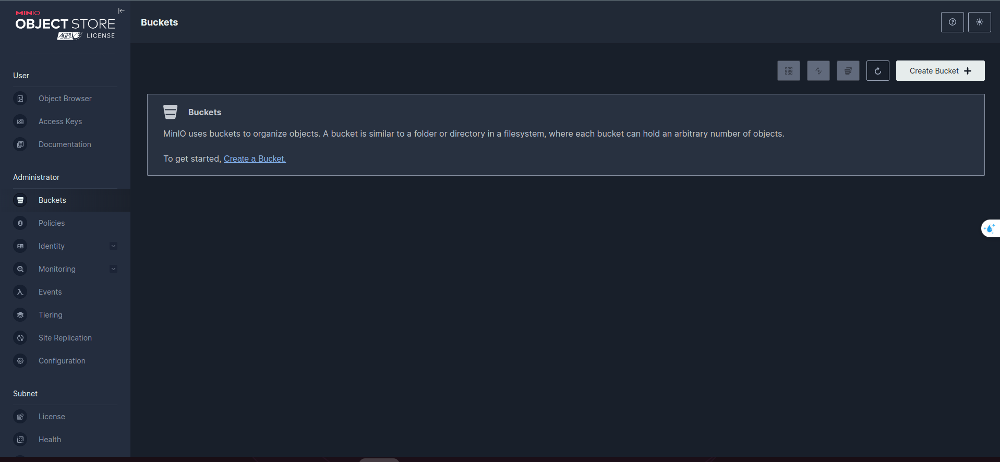
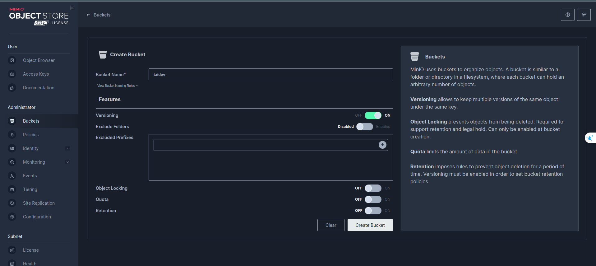
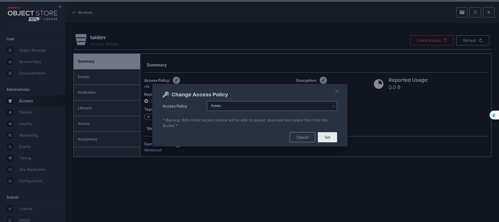
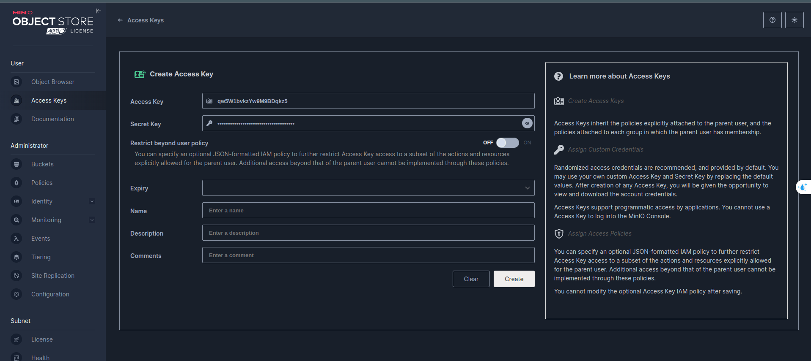
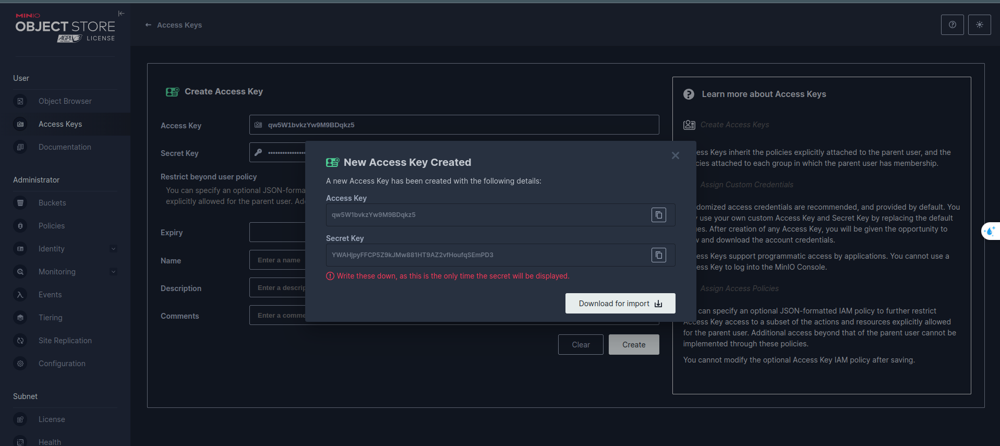
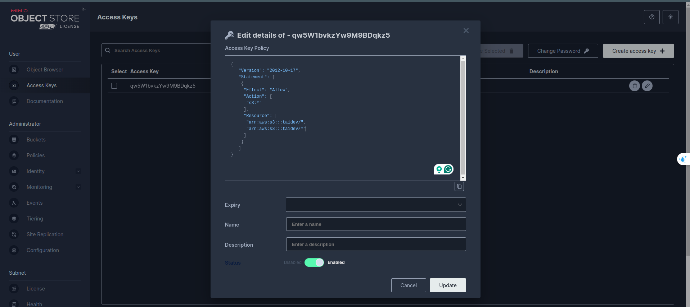

# 1. Choose > Create Buckets

# 2. Choose > Setup as image

# 3. Choose > Access Policy > Choose public

# 4. Choose > Access Keys > Create access keys

# 5. Choose > Create > It will auto create AccessKey and SecretKey

# 5. Click key just created > copy file policy > 

